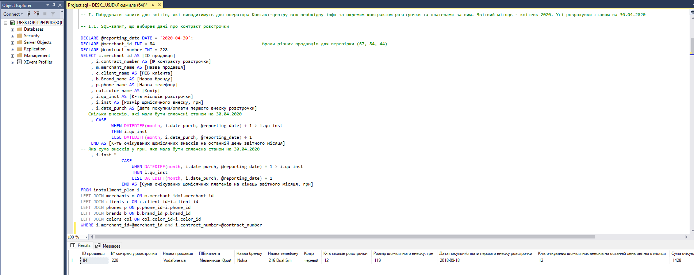
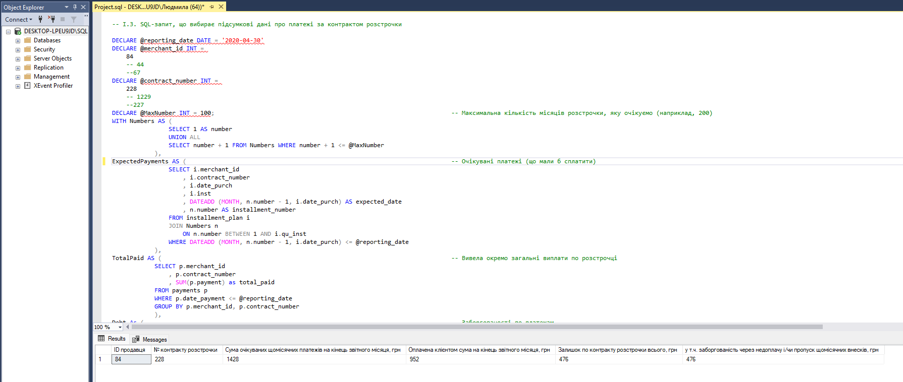
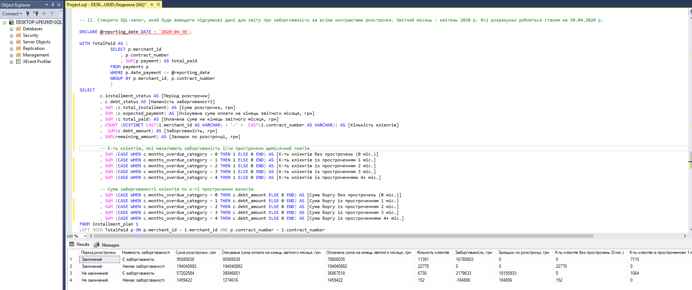
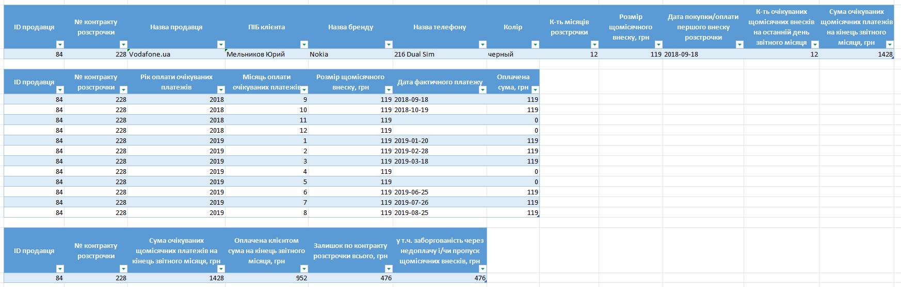
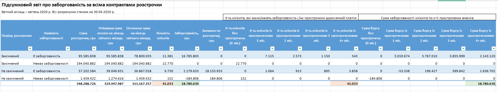

# Installment Plans — SQL Analytics Project


SQL Server project that analyzes phone installment **contracts** and **payments** at a fixed **reporting date** (point-in-time).  
Outputs include: expected vs. paid amounts, **debt** due to missed/underpaid installments, and **overdue buckets** (0/1/2/3/4+ months).

---

## Business context
An e-commerce store sells phones via installment plans. We need fast, reproducible views for:
1) A **single contract** (details → monthly ledger → summary as of a reporting date).  
2) The **whole portfolio** (finished/not finished, has debt/no debt, counts & debt by overdue buckets).

---

## Data model
**Tables**
- `dbo.installment_plan` — master contracts: `merchant_id`, `contract_number`, `client_id`, `phone_id`, `color_id`, `price`, `date_purch`, `qu_inst`, `inst`
- `dbo.payments` — payment facts: `merchant_id`, `contract_number`, `date_payment`, `payment`

---

## Data dictionary

| Table                 | Column           | Type          | Description                                |
|----------------------|------------------|---------------|--------------------------------------------|
| dbo.installment_plan | merchant_id      | TINYINT       | Seller ID (part of composite key)          |
|                      | contract_number  | INT           | Contract number per merchant (part of PK)  |
|                      | client_id        | INT           | Client identifier                           |
|                      | phone_id         | INT           | Phone/model identifier                      |
|                      | color_id         | TINYINT       | Color identifier                            |
|                      | price            | NUMERIC(10,2) | Contract total price (optional)             |
|                      | date_purch       | DATE          | Purchase / first installment date           |
|                      | qu_inst          | INT           | Number of installments (months)             |
|                      | inst             | INT           | Monthly installment amount (UAH)            |
| dbo.payments         | merchant_id      | TINYINT       | Seller ID (FK to installment_plan)          |
|                      | contract_number  | INT           | Contract number (FK to installment_plan)    |
|                      | date_payment     | DATE          | Actual payment date                          |
|                      | payment          | INT           | Paid amount (UAH)                            |

**Composite key:** (`merchant_id`, `contract_number`) on `dbo.installment_plan`.  
**FK:** `dbo.payments` → `dbo.installment_plan` by (`merchant_id`, `contract_number`).

---

## Schema (DDL)
See `sql/01_schema.sql`. Optional constraints & index: `sql/06_constraints_indexes.sql`.

---

## How to run (quick)
1. Run `sql/01_schema.sql`.
2. Import data (see `scripts/02_import_notes.md`).  
   *(Tip: if dates are `dd.MM.yyyy`, import to staging as NVARCHAR and `CONVERT(date, ..., 104)`.)*
3. (Optional) Run validations: `scripts/90_validation_checks.sql`.
4. Single-contract reports:
   - `sql/02_contract_details.sql`
   - `sql/03_contract_payments.sql`
   - `sql/04_contract_summary.sql`
5. Portfolio report:
   - `sql/05_portfolio_debt_summary.sql`

> Default `@reporting_date` in scripts: `2020-04-30`. Adjust `@merchant_id` / `@contract_number` for checks (e.g., 67/227, 84/228, 44/1229).

---

**Parameters used in reports**
- `@reporting_date` (DATE) — snapshot date (default `2020-04-30`)
- `@merchant_id` (INT) — seller for single-contract reports
- `@contract_number` (INT) — contract number for single-contract reports

---

## SQL highlights
- Point-in-time logic with a parameterized `@reporting_date`
- Month arithmetic (`DATEDIFF`, capping expected installments at `qu_inst`)
- Reusable month generator: [util/my_period.sql](util/my_period.sql)
- Clean aggregations for overdue **buckets 0/1/2/3/4+** (counts + debt)

---

## Repository structure

```
/sql
  01_schema.sql
  02_contract_details.sql
  03_contract_payments.sql
  04_contract_summary.sql
  05_portfolio_debt_summary.sql
  06_constraints_indexes.sql
/util
  my_period.sql
/scripts
  02_import_notes.md
  90_validation_checks.sql
/data
/images
/artifacts
  InstallmentReports_2020-04_anonymized.xlsx

```

---

## SQL files (quick links)
- [01_schema.sql](sql/01_schema.sql)
- [02_contract_details.sql](sql/02_contract_details.sql)
- [03_contract_payments.sql](sql/03_contract_payments.sql)
- [04_contract_summary.sql](sql/04_contract_summary.sql)
- [05_portfolio_debt_summary.sql](sql/05_portfolio_debt_summary.sql)
- [06_constraints_indexes.sql](sql/06_constraints_indexes.sql)
- [02_import_notes.md](scripts/02_import_notes.md)
- [90_validation_checks.sql](scripts/90_validation_checks.sql)
---
## Screenshots
**SSMS** – contract details / summary / portfolio





**Excel** – single-contract pack / portfolio summary




---

## Sample output (Excel)
Download: [`InstallmentReports_2020-04_anonymized.xlsx`](artifacts/InstallmentReports_2020-04_anonymized.xlsx)

Sheets:
- `contract_details` — output of `sql/02_contract_details.sql`
- `contract_payments` — output of `sql/03_contract_payments.sql`
- `contract_summary` — output of `sql/04_contract_summary.sql`
- `portfolio_summary` — output of `sql/05_portfolio_debt_summary.sql`

---

## Sample data (CSV)
Small anonymized inputs to try the scripts quickly:

- [`data/installment_plan_sample.csv`](data/installment_plan_sample.csv)
- [`data/payments_sample.csv`](data/payments_sample.csv)

**Notes**
- Separator: `,` (comma). Encoding: UTF-8.
- Date format: `yyyy-mm-dd`.
- Composite key for contracts = (`merchant_id`, `contract_number`).
- You can import via SSMS Import Wizard or `BULK INSERT` (see `scripts/02_import_notes.md`).

---

## Environment
- SQL Server 2019+ (tested on 2019/2022; compatible with Azure SQL)
- SSMS 20.x (or 19+)

## License
MIT.

## Credits
Implementation and documentation by **Liudmyla Sibikovska**.
